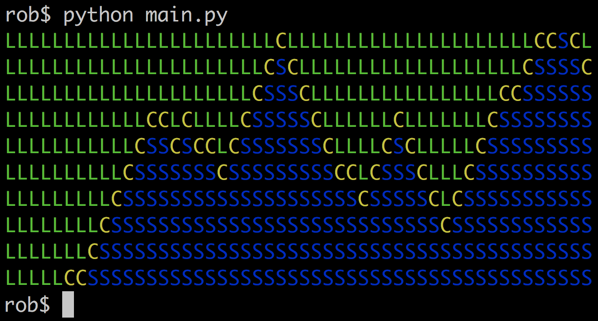

# Wavefunction Collapse

This is the example code for my blog post, ["The Wavefunction Collapse Algorithm explained very clearly"](https://robertheaton.com/2018/12/17/wavefunction-collapse-algorithm/). To install dependencies:

```
virtualenv vendor
source vendor/bin/activate
pip install -r requirements.txt
```

Then to run:

```
python main.py
```

You will get a nice picture of a coastline.


